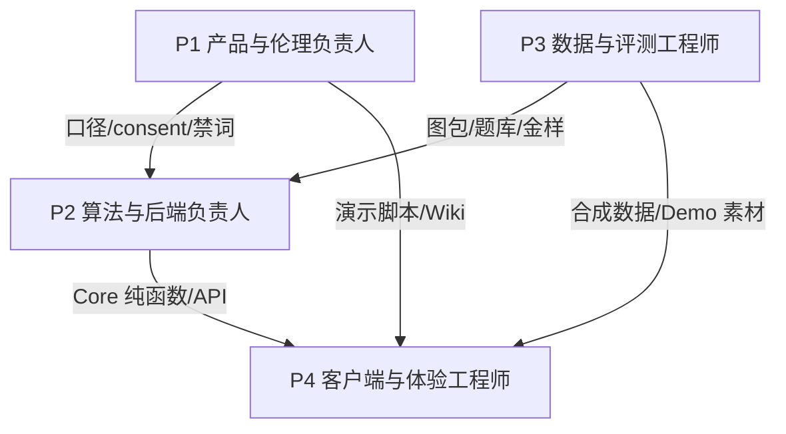
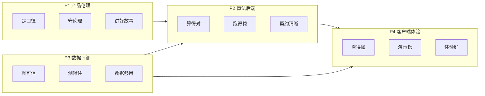
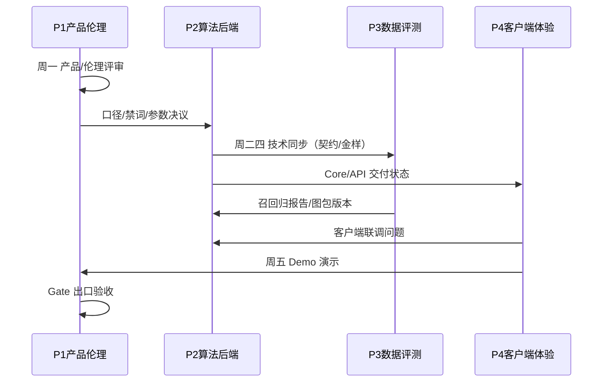
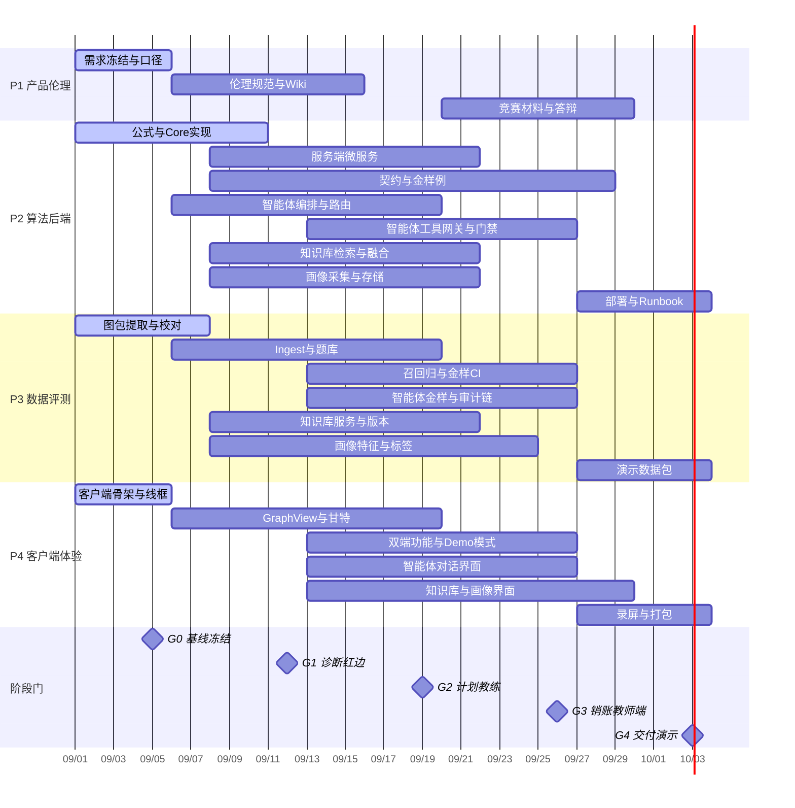
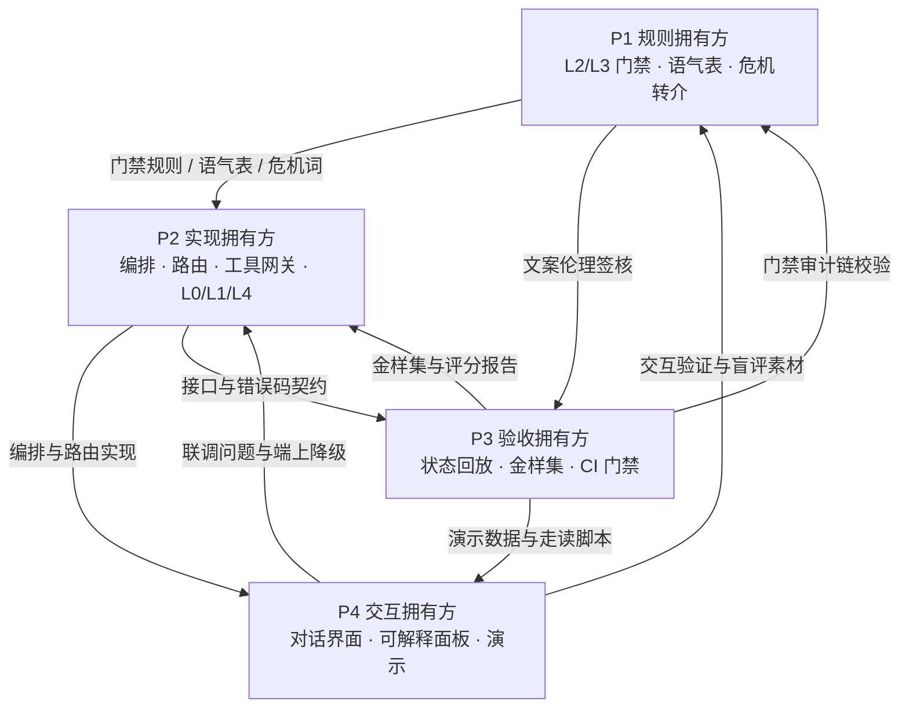

# 知债：星穹学途（Knowledge Debt: Astral Path）· 四人项目团队分工方案

> **项目**：知债：星穹学途（Knowledge Debt: Astral Path） · 跨课程知识债诊断与修复智能体
> **赛题**：2026 iCAN AI 无代码智能体挑战赛 · DuMate 智能体应用创新
> **周期**：6 周（G0–G4 阶段门）
> **团队**：4 人
> **关联文档**：《知债：星穹学途 · 合并版技术方案（契约 + 跨端客户端版）》
> **版本**：team-division-v2.1.0-algo-v2

---

## 目 录

- [一、总体设计原则](#一总体设计原则)
- [二、四位成员角色定位](#二四位成员角色定位)
  - [P1 · 产品与教育伦理负责人](#p1--产品与教育伦理负责人pm--domain-owner)
  - [P2 · 算法与后端技术负责人](#p2--算法与后端技术负责人tech-lead--algorithm-owner)
  - [P3 · 数据与评测工程师](#p3--数据与评测工程师data--qa-owner)
  - [P4 · 客户端与体验工程师](#p4--客户端与体验工程师client--ux--demo-owner)
- [三、协作机制与沟通流程](#三协作机制与沟通流程)
- [四、阶段性目标与时间节点](#四阶段性目标与时间节点六周)
- [五、工作成果审核与验收标准](#五工作成果审核与验收标准)
- [六、风险与应急分工](#六风险与应急分工)
- [七、一页纸职责速查](#七一页纸职责速查)
- [八、核心功能模块与文档治理分工](#八核心功能模块与文档治理分工)
  - [8.1 智能体模块 RACI 矩阵](#81-智能体模块-raci-矩阵)
  - [8.2 项目名称标准化分工](#82-项目名称标准化分工)
  - [8.3 文档审核与一致性检查分工](#83-文档审核与一致性检查分工)
  - [8.4 智能体模块协作关系](#84-智能体模块协作关系)
  - [8.5 知识库模块分工（方案 §45）](#85-知识库模块分工方案-45)
  - [8.6 用户画像模块分工（方案 §46）](#86-用户画像模块分工方案-46)

---

## 零基础 3 分钟看懂分工

| 人 | 管什么 | 一句人话 |
|----|--------|----------|
| P1 | 产品 + 伦理 | 想清楚做什么，保证不伤人 |
| P2 | 算法 + 后端 | 让分数算得准、状态不错乱 |
| P3 | 数据 + 测试 | 出题、批改「我们的程序」 |
| P4 | 界面 + 安装包 | 手机/电脑好用、能装上、能演示 |

**共同红线**：数字只能由代码算出；AI 不许改分；「已还清」只有状态机能写。

**互相怎么配合（一句话）**：P2 算出数字 → P3 验收对不对 → P4 做成界面 → P1 决定对用户怎么说。

---
## 一、总体设计原则

| 原则 | 落地方式 |
|---|---|
| 职责无重叠 | 每个微服务、每个交付物只有一位 Owner；协作方只消费不改写 |
| 专业匹配 | 算法/后端、数据/评测、产品/伦理、客户端/演示四条线 |
| 可并行 | W1 起 P3 做图包、P2 做公式、P4 搭客户端壳、P1 冻结口径 |
| 可验收 | 每阶段 Gate 绑定 Owner 与客观金样，不靠口头确认 |

**团队结构（4 人）：**



**职责总览：**



---

## 二、四位成员角色定位

### P1 · 产品与教育伦理负责人（PM / Domain Owner）

| 维度 | 内容 |
|---|---|
| **角色定位** | 项目第一责任人；课程业务与伦理口径的唯一出口 |
| **核心职责** | 需求分析、课程包范围、consent 规范、禁词表、Wiki、竞赛材料、答辩 |
| **专业优势发挥** | 教育领域理解、沟通协调、文档与叙事能力 |
| **不负责** | 代码实现、公式计算、图数据录入、客户端开发（可提需求，不直接改） |

#### 具体任务清单

| 阶段 | 任务 | 交付物 |
|---|---|---|
| 需求分析 (W0–W1) | 组织 Kickoff，宣贯「计算与叙事分离」「伦理闸门」两大铁律 | 会议纪要 + 口径决议单 |
| 需求分析 (W0–W1) | 冻结会计学课程包范围（专业、课程、边界） | 课程包口径文档 |
| 需求分析 (W0–W1) | 定义 consent 规范与禁词表初稿 | consent 规范 + 禁词表 v1 |
| 需求分析 (W0–W1) | 确认合成数据使用声明、隐私边界 | 合规声明页脚文案 |
| 设计 (W1–W2) | 参与 BASELINE 评审（表结构、公式、约束、错误码） | RFC 签字 |
| 设计 (W1–W2) | 定义 `course_priority` / `exam_proximity` 等业务参数 | 参数配置表 |
| 设计 (W1–W2) | 撰写 Wiki 13 篇大纲 | Wiki 目录 |
| 开发 (W2–W4) | 维护禁词表与叙事话术模板 | 词表 PR + 模板库 |
| 开发 (W2–W4) | 把关 narrative / teacher_brief 文案伦理 | 话术评审记录 |
| 开发 (W2–W4) | 确认页脚免责与「非处分」定位 | 合规检查清单 |
| 测试 (W4–W5) | 组织 consent 全场景伦理测试评审 | 伦理测试报告签字 |
| 测试 (W4–W5) | 参与图包双人校对（口径侧） | 校对签字单 |
| 部署/交付 (W5–W6) | 竞赛材料包（简介、PDF≤20页、Wiki） | 材料包定稿 |
| 部署/交付 (W5–W6) | 3 分钟/10 分钟演示脚本与口播 | 演示脚本定稿 |
| 部署/交付 (W5–W6) | 答辩与评委沟通 | 答辩 Q&A 手册 |
| 智能体 (W2–W3) | 冻结危机词表与人工转介口径（§44.2.2 R0） | 危机词表 + 转介话术卡 |
| 智能体 (W2–W4) | 定义并维护门禁 L2/L3 规则：禁词、槽位、语气四规则（§44.5.2/§44.5.3） | 门禁规则表 + 语气表 |
| 智能体 (W3–W4) | 审定智能体响应文案模板（§44.6.6）并做伦理签核 | 文案模板 + 签核记录 |
| 智能体 (W4) | 主持语气盲评（≥4.0/5），处理 `meta.feedback` 回流 | 盲评报告 |
| 名称标准化 (W1) | 冻结项目名称口径（全称/中文简称/英文标识），审核所有对外材料命名 | 名称规范页 |
| 文档审核 (W5–W6) | 终审全部交付文档的命名一致性与伦理口径 | 一致性检查签字 |
| 知识库 (W2–W4) | 冻结知识库可见性口径（private/consented/course/public）与版权声明要求 | 可见性口径表 + 版权声明模板 |
| 知识库 (W3–W4) | 审核 `public` 可见性文档与 `topic/misconception` 标签；违规内容处置 | 内容审核记录 |
| 画像 (W2–W3) | 冻结画像标签口径、禁列语义域词表（`@P1` + `@P3` 双签） | 标签口径 + 禁列词表 v1 |
| 画像 (W3–W5) | 审核教师侧聚合画像页（consent + k-匿名）；撰写用途声明 | 合规审核签字 + 用途声明文案 |
| 画像 (W4–W5) | 验证 opt-out / 导出 / 删除三条学生权利路径的可用性 | 权利路径验收记录 |

#### 所需技能

教育/会计领域知识、需求分析、技术写作、伦理意识、项目管理、公开演讲

#### 预期贡献

保证项目「方向正确、口径统一、伦理可辩护、竞赛叙事完整」

#### 服务归属（方案 §0.1）

| 服务 | 角色 |
|---|---|
| narrative-svc | Owner（话术与安全规范） |
| consent-svc | Owner（伦理闸门规范） |
| Wiki / 竞赛材料 / 答辩 | Owner |

---

### P2 · 算法与后端技术负责人（Tech Lead / Algorithm Owner）

| 维度 | 内容 |
|---|---|
| **角色定位** | 技术第一责任人；公式、状态机、服务端契约的唯一权威 |
| **核心职责** | mastery/debt/planner/coach/progress 算法实现，ModelService 边界，Gateway，契约测试，Core 纯函数库 |
| **专业优势发挥** | 算法能力、C#/.NET、系统设计、并发与状态机 |
| **不负责** | 图数据录入、题库内容、客户端 UI、竞赛材料撰写 |

#### 具体任务清单

| 阶段 | 任务 | 交付物 |
|---|---|---|
| 需求/设计 (W0–W1) | 冻结 score/impact/K1–K5/销账公式与约束 | BASELINE 算法契约 |
| 需求/设计 (W0–W1) | 确定 `recent_acc` / `freq` 统计窗口 | 参数决议（OWNER-TBD #1/#2） |
| 需求/设计 (W0–W1) | 设计 `AstralPath.Core` 纯函数接口 | Core 接口定义 + 项目骨架 |
| 开发 (W1–W2) | 实现 MasteryCalculator、DebtScanner | Core 包 + 单元测试 |
| 开发 (W1–W2) | 实现 planner 约束检查器 K1–K5 | PlannerConstraintChecker |
| 开发 (W1–W2) | 实现 progress 销账状态机 | SaleStateMachine（cleared 唯一入口） |
| 开发 (W1–W2) | 实现 mastery-svc / debt-svc / coach-svc 服务端 | 微服务 + API |
| 开发 (W2–W3) | 接入 ModelService 5 purpose + 禁词门禁 | Model 管线 |
| 开发 (W2–W3) | 实现 Gateway 角色路由 + consent 中间件 | Gateway 配置 |
| 开发 (W2–W3) | 编写 OpenAPI 契约与契约测试 | 契约文件 + CI 门禁 |
| 开发 (W3–W4) | 实现扩展微服务（diffusion/velocity 等，按优先级） | 可选微服务 |
| 开发 (W3–W4) | 与 P4 对接：导出 Core 供客户端复算 | 客户端可引用的 Core |
| 测试 (W2–W5) | 金样例实现与 CI 挂载（1e-6 对齐） | 金样例库全绿 |
| 测试 (W2–W5) | 召回参数调优（若 <0.80） | 调优记录 + 回归报告 |
| 部署 (W5–W6) | 服务端部署配置、环境矩阵、演示日值守方案 | 部署脚本 + Runbook |
| 智能体 (W1–W2) | 设计并实现智能体编排架构（§44.1），落地架构图与调用约束 AC-1–AC-6 | `AstralPath.Agent` 骨架 + 架构图 |
| 智能体 (W2–W3) | 实现意图路由器 R0–R6 与登记表 `agent-intents.yaml`（§44.2） | 路由器 + 24 意图登记表 |
| 智能体 (W2–W3) | 实现工具白名单网关五道闸与 `agent-tools.yaml`（§44.3） | 工具网关 + 22 工具登记表 |
| 智能体 (W3–W4) | 实现对话状态机与持久化（乐观锁 + 回放）（§44.4） | `agent_session` + 回放工具 |
| 智能体 (W3–W4) | 实现门禁 L0/L1/L4 与降级矩阵（§44.5/§44.7.3） | 门禁链 + 降级演练报告 |
| 名称标准化 (W1) | 执行代码侧改名：`AstralPath.sln` / 命名空间 / 包名 / 镜像名 / 域名 | 改名后全绿构建 |
| 文档审核 (W2 起) | 评审智能体契约文档与 OpenAPI diff，保证契约一致性 | 契约评审记录 |
| 知识库 (W2–W3) | 实现 `kb-search-svc`：切分、FTS 索引、HNSW 向量索引、可见性前置过滤 | 检索服务 + 索引流水线 |
| 知识库 (W3–W4) | 实现 RRF 融合与业务重排（公式见方案 §45.4.4），落金样 1e-6 | 融合实现 + 金样通过 |
| 知识库 (W3–W4) | 分片直传预签名、异步解析 worker 池与背压控制 | 上传通道 + 解析池 |
| 画像 (W2–W3) | 实现 `profile-collector`：白名单采集、字段裁剪、幂等去重、按月分区 | 采集管道 + 分区表 |
| 画像 (W3–W4) | 实现画像存储与快照（含 JSONB 投影与 `content_hash`）、水平扩展方案 | 存储层 + 扩展方案 |

#### 所需技能

算法/公式推导、C#/.NET 10、微服务、数据库设计、单元测试、契约驱动开发

#### 预期贡献

保证「数字可信、状态机正确、端到端可跑、客户端复算一致」

#### 服务归属（方案 §0.1）

| 服务 | 角色 |
|---|---|
| mastery-svc | Owner（公式唯一来源） |
| debt-svc | Owner（impact 计算） |
| planner-svc | Owner（约束检查） |
| coach-svc | Owner（自适应规则） |
| progress-svc | Owner（销账状态机） |
| ModelService / Gateway / scheduler | Owner |

---

### P3 · 数据与评测工程师（Data / QA Owner）

| 维度 | 内容 |
|---|---|
| **角色定位** | 数据资产与质量门禁的唯一出口；算法正确性的独立验证方 |
| **核心职责** | 会计学图包、成绩/错题接入、题库、合成数据生成器、金样例注册、召回回归、CI 质量门禁 |
| **专业优势发挥** | 数据工程、SQL、测试设计、统计评测 |
| **不负责** | 算法公式实现（由 P2 实现，P3 验证）、客户端 UI、竞赛文案 |

#### 具体任务清单

| 阶段 | 任务 | 交付物 |
|---|---|---|
| 需求/设计 (W0–W1) | 从培养方案提取会计学知识点与先修边 | 图包 v0（≥30kp/≥40 边） |
| 需求/设计 (W0–W1) | 与 P1 双人校对，标注边来源 | 校对签字 + source 字段 |
| 需求/设计 (W0–W1) | 设计合成双学生画像（A 有债预埋/B 无债） | 学生画像规格 |
| 需求/设计 (W0–W1) | 设计 ingest 体检规则（缺字段/异常分） | 体检规则表 |
| 开发 (W1–W2) | 实现 pack-svc / graph-svc（无环校验、版本化） | 图服务 + publish 流程 |
| 开发 (W1–W2) | 实现 ingest-svc（CSV/演示数据导入） | 导入服务 |
| 开发 (W1–W2) | 实现 assessment-svc 题库挂载（客观题） | 题库服务 + 首批题 |
| 开发 (W1–W2) | 实现合成数据生成器 synth-30 | 生成器脚本 + 30 学生数据 |
| 开发 (W2–W4) | 实现 eval-svc（召回回归、金样执行） | 评测服务 |
| 开发 (W2–W4) | 构建金样例库（公式/债边/约束/销账/consent） | golden/ 目录 + CI |
| 开发 (W2–W4) | 预埋 20 条真债边用于召回评测 | 标注集 |
| 测试 (W2–W5) | 每日/每 PR 运行金样例与召回回归 | 回归报表 |
| 测试 (W2–W5) | 召回 ≥0.80 验证；失败则协同 P2 调参 | 召回报告签字 |
| 测试 (W2–W5) | 图包版本回归（publish 不破坏历史） | 版本回归用例 |
| 部署 (W5–W6) | 演示数据包（双学生 + 第 7 天状态） | demo 数据集 |
| 部署 (W5–W6) | 金样例门禁接入 CI 阻断 merge | CI 配置 |
| 智能体 (W2–W3) | 建立智能体金样目录与文件规范（routing/tools/state/gates/response）（§44.6.1） | `eval/golden/agent/` 骨架 |
| 智能体 (W3–W4) | 编写智能体金样集 ≥54 条（含越权/禁词/危机三类必测）（§44.6.4） | 金样集 + 评分报告 |
| 智能体 (W3–W4) | 实现状态回放一致性校验与 `stateHash` 断言（§44.4.3） | 回放测试套件 |
| 智能体 (W3–W4) | 实现 `gate_audit` 只追加审计链与链式哈希校验（§44.5.4） | 审计链 + 校验脚本 |
| 智能体 (W4) | 落地 `verify-agent-gates.ps1` CI 门禁与评测指标总表（§44.7） | CI 全绿证明 |
| 名称标准化 (W1) | 校验图包/数据集/金样文件内的旧名残留（知债图 / ZhiZhaiTu / zhizhaitu） | 残留扫描报告 |
| 文档审核 (W2 起) | 校验文档中的公式、错误码、接口清单与实现一致 | 一致性核对表 |
| 知识库 (W2–W4) | 实现 `kb-svc`：文档/版本/标签/发布审计；数据库触发器强制版本不可变（§45.5.3） | `kb-svc` + 不可变触发器 |
| 知识库 (W3–W4) | 实现发布状态机与回滚；链式哈希审计链校验 | 状态机 + 审计校验脚本 |
| 知识库 (W3–W4) | 编写知识库金样 7 条（含越权、consent 撤销、不可变性） | `eval/golden/kb/` + 报告 |
| 画像 (W2–W3) | 实现 8 项特征纯函数（`profile-feat-v1`），落金样 1e-6 | 特征实现 + 金样通过 |
| 画像 (W3–W4) | 实现标签规则 DSL 引擎与禁列词表校验（§46.3.3/§46.3.4） | 规则引擎 + 禁列门禁 |
| 画像 (W3–W5) | 编写画像金样 9 条（含 opt-out 等价性、k-匿名、样本不足、删除级联） | `eval/golden/profile/` + 报告 |
| 画像 (W4) | 实现 `profile_access_log` 链式哈希与画像导出/删除级联 | 审计链 + 权利路径 |

#### 所需技能

SQL/数据建模、测试工程、统计评测、Python/脚本、质量管理

#### 预期贡献

保证「图包可信、数据可测、召回达标、金样例 100% 通过」

#### 服务归属（方案 §0.1）

| 服务 | 角色 |
|---|---|
| pack-svc | Owner（课程包版本） |
| graph-svc | Owner（图节点/边、无环校验） |
| ingest-svc | Owner（数据导入体检） |
| assessment-svc | Owner（题库与判分） |
| eval-svc | Owner（召回回归） |

---

### P4 · 客户端与体验工程师（Client / UX / Demo Owner）

| 维度 | 内容 |
|---|---|
| **角色定位** | 评委可见界面的唯一负责人；演示体验与视觉冲击力的直接决定者 |
| **核心职责** | Avalonia Desktop（图谱/甘特/教师端/What-if）、Mobile（今日任务/练习）、Demo 模式、录屏、材料视觉 |
| **专业优势发挥** | UI/UX、Avalonia/XAML、C# 客户端、可视化、演示设计 |
| **不负责** | 公式实现（调用 P2 的 Core）、图数据生产、服务端逻辑、竞赛文案终稿（P1 定稿，P4 做视觉） |

#### 具体任务清单

| 阶段 | 任务 | 交付物 |
|---|---|---|
| 需求/设计 (W0–W1) | 确认双端信息架构（Desktop 导航 / Mobile Tab） | 线框图 + 导航规格 |
| 需求/设计 (W0–W1) | 确认主路径「边列表视图」（可访问性优先） | GraphView 交互规格 |
| 需求/设计 (W0–W1) | 搭建 `AstralPath.sln` 客户端骨架（Desktop+Mobile+Shared） | 可编译解决方案 |
| 开发 (W1–W2) | Desktop 静态图渲染（节点/边/红边高亮） | GraphView v1 |
| 开发 (W1–W2) | 接入 P2 Core 做 impact 端上复算旁注 | 手算旁注组件 |
| 开发 (W1–W2) | Demo 模式：Student A/B 切换 | Demo 服务 + 快捷键 |
| 开发 (W2–W3) | 14 天计划甘特图 + 约束检查绿灯展示 | PlanGanttView |
| 开发 (W2–W3) | Mobile 今日任务卡片流（35 分钟胶囊） | TodayView |
| 开发 (W2–W3) | Mobile 练习页 + 信心滑条 | PracticeView |
| 开发 (W3–W4) | 教师热点页 + consent 开关实时联动 | TeacherHotspotsView |
| 开发 (W3–W4) | What-if 滑条模拟器（演示高光） | WhatIfSimulatorView |
| 开发 (W3–W4) | 销账进度环 + 徽章动画（Mobile） | 进度组件 |
| 测试 (W3–W5) | Avalonia.Headless UI 测试 | UI 测试套件 |
| 测试 (W3–W5) | 性能门禁：冷启动≤1.5s、400 节点 60fps | 性能测试报告 |
| 测试 (W3–W5) | 无 LLM 降级：边表+模板计划仍可展示 | 降级验收用例 |
| 部署/交付 (W5–W6) | Desktop MSIX + Android AAB 打包 | 安装包 |
| 部署/交付 (W5–W6) | 3 分钟/10 分钟演示录屏（含故障预案彩排） | 录屏定稿 |
| 部署/交付 (W5–W6) | 演示日现场操作与备用设备准备 | 演示检查清单 |
| 智能体 (W2–W3) | 设计对话式交互界面（输入框、澄清追问、能力清单、可点击动作）（§44.6.5） | Agent 对话页原型 |
| 智能体 (W3–W4) | 渲染 `gateTrace` / `safetyFlags` 的可解释展示（教师端与管理端） | 可解释面板 |
| 智能体 (W3–W4) | 验证响应文案模板在双端的信息密度与无障碍（§44.6.6） | 文案验证记录 |
| 智能体 (W4–W5) | 编排演示链路 ≥2 条「意图 → 工具 → 门禁 → 响应」完整走读 | 演示脚本片段 |
| 名称标准化 (W1) | 更新客户端解决方案名、包名（`com.astralpath.*`）、安装包名与界面标题 | 改名后双端可安装 |
| 文档审核 (W4–W5) | 校验所有截图/录屏/UI 文案中的项目名称一致性 | 视觉一致性检查单 |
| 知识库 (W2–W3) | 知识库前端：文档列表、标签筛选、上传进度、版本历史与回滚确认 | 知识库管理页 |
| 知识库 (W3–W4) | 检索结果页：高亮片段、来源锚点跳转、`scoreBreakdown` 可解释展示 | 检索结果页 |
| 画像 (W3–W4) | 画像可视化四件套：六维雷达、成长时间线、标签云、学习时段热力图 | 画像页 + 四组件 |
| 画像 (W3–W5) | 依据抽屉（标签 → 特征 → 窗口 → 样本量）与 opt-out 开关入口 | 可解释抽屉 + 设置项 |
| 画像 (W4–W5) | 教师侧聚合画像页（仅标签占比，无个体、无排名）+ 用途声明展示 | 聚合画像页 |

#### 所需技能

Avalonia/.NET、XAML、UI/UX 设计、数据可视化、性能优化、视频录制

#### 预期贡献

保证「演示 10 秒讲清、视觉有冲击、故障可降级、双端可用」

#### 服务归属（方案 §0.1）

| 服务/模块 | 角色 |
|---|---|
| bff-student / bff-teacher | Owner |
| AstralPath.Desktop / AstralPath.Mobile | Owner |
| GraphView / Demo 模式 / 录屏 | Owner |
| report-svc（展示层） | Owner |

---

## 三、协作机制与沟通流程

### 3.1 例会与同步

| 会议 | 频率 | 参与人 | 议题 | 时长 |
|---|---|---|---|---|
| 每日站会 | 每天 | 全员 | 昨日/今日/阻塞 | 10 分钟 |
| 技术同步会 | 每周二、四 | P2 + P3 + P4 | 契约变更、联调、金样结果 | 30 分钟 |
| 产品/伦理评审 | 每周一 | P1 主持，全员 | 口径确认、话术评审、风险 | 30 分钟 |
| 周度 Demo | 每周五 | 全员 | 可运行增量演示 + Gate 检查 | 45 分钟 |
| 阶段门评审 | Gate 当天 | 全员 | 出口标准逐项验收 | 60 分钟 |

### 3.2 协作接口（关键交接点）

| 交接 | 提供方 → 消费方 | 内容 | 完成节点 |
|---|---|---|---|
| 口径冻结 | P1 → 全员 | 课程包范围、consent、禁词、业务参数 | W1 末 |
| 算法契约 | P2 → P3/P4 | Core 接口、金样期望值、错误码 | W1 末 |
| 图包交付 | P3 → P2/P4 | publish 后的 graph_version + 合成学生数据 | W1 末 / 持续 |
| Core 引用 | P2 → P4 | `AstralPath.Core` 可编译项目/NuGet | W2 起 |
| API 契约 | P2 → P4 | OpenAPI + Mock | W2 起 |
| 演示脚本 | P1 → P4 | 口播稿 + 镜头表 | W5 末 |
| 材料视觉 | P4 → P1 | 图表、截图、录屏片段 | W5–W6 |
| 智能体门禁规则 | P1 → P2 | L2/L3 规则、语气四规则、危机词与转介话术 | W3 末 |
| 智能体意图与工具登记表 | P2 → P3 | `agent-intents.yaml` / `agent-tools.yaml`（唯一事实来源） | W2 末 |
| 智能体接口与错误码契约 | P2 → P4 | `/v1/agent/*` OpenAPI + Mock | W3 起 |
| 智能体金样集与评分报告 | P3 → P2 | `eval/golden/agent/` + 评分维度结果 | W3 起 / 持续 |
| 智能体对话交互验证 | P4 → P1 | 文案信息密度、可解释面板、盲评素材 | W4–W5 |
| 知识库可见性口径 | P1 → P2 | 四级可见性定义、版权声明要求、复核清单 | W2 末 |
| 知识库检索索引契约 | P2 → P3/P4 | 索引字段、`scoreBreakdown` 结构、证据锚点格式 | W3 起 |
| 知识库内容与版本 | P3 → P2/P4 | 文档/版本/标签状态机、发布与回滚语义 | W3 起 |
| 画像标签口径与禁列词表 | P1 → P3 | 三层标签定义、禁列语义域、表述规则 | W2 末 |
| 画像特征契约 | P3 → P2/P4 | `FeatureSet` 字段、窗口、`featureVersion`、null 语义 | W3 起 |
| 画像可视化数据契约 | P3 → P4 | 雷达六维投影、快照时间线、热力图聚合口径 | W3–W4 |

### 3.3 沟通流程



**协作规则：**

- 契约变更必须走 RFC，P2 主笔，P1/P3/P4 签字后才可编码
- 金样例失败视为 P0 阻塞，P2/P3 当日响应
- 禁词表变更必须 P1 + P2 双签 PR
- 客户端不得直接调用未冻结 API，一律经 Mock → 契约 → 联调三阶段

### 3.4 工具与协作规范

| 用途 | 工具 | 规范 |
|---|---|---|
| 代码托管 | Git + monorepo | 分支：`feat/*`、`fix/*`；关键 PR 双人审 |
| 任务看板 | GitHub Projects / 飞书 | 任务卡必须关联 Owner 与 Gate |
| 文档 | Wiki（方案同步） | 口径变更 24h 内更新 Wiki |
| 金样例 | CI 测试报告 | 每日自动跑，失败发群 |
| 设计稿 | Figma / 线框图 | P4 维护，P1 评审 |
| 演示录屏 | OBS / 系统录制 | P4 主录，P1 审口播 |

### 3.5 Monorepo 目录与 Owner 边界

```text
astral-path/                     # 仓库名与 AstralPath 标识一致
├── contracts/                  # OpenAPI、错误码、金样 schema          Owner: P2
├── src/
│   ├── AstralPath.Core/         # 公式/约束/状态机纯函数                Owner: P2
│   ├── AstralPath.Graph/        # 图模型与拓扑                          Owner: P2
│   ├── AstralPath.Contracts/    # API 客户端/DTO                        Owner: P2
│   ├── AstralPath.Infrastructure/ # HTTP/SQLite/安全存储               Owner: P2
│   ├── AstralPath.Agent/        # 受约束智能体（§44）                    Owner: P2
│   │   ├── Routing/            #   意图路由器 R0–R6                    Owner: P2
│   │   ├── Tools/              #   工具白名单网关（五道闸）              Owner: P2
│   │   ├── State/              #   对话状态跟踪与回放                   Owner: P2 + P3
│   │   ├── Gates/              #   门禁链 L0–L4                        Owner: P1 + P2
│   │   └── Audit/              #   gate_audit 只追加审计链              Owner: P3
│   ├── AstralPath.Kb/           # 知识库（§45）                          Owner: P3
│   │   ├── Documents/          #   文档 / 版本 / 发布状态机              Owner: P3
│   │   ├── Tags/               #   三层标签与打标规则                    Owner: P3
│   │   ├── Search/             #   切分 / FTS / HNSW / RRF 融合          Owner: P2
│   │   └── Publish/            #   kb_publish_log 链式哈希审计           Owner: P3
│   ├── AstralPath.Profile/      # 用户画像（§46）                        Owner: P3
│   │   ├── Collect/            #   白名单采集与字段裁剪                  Owner: P2
│   │   ├── Features/           #   8 项纯函数特征（金样 1e-6）           Owner: P3
│   │   ├── Tags/               #   标签规则 DSL 引擎与禁列校验           Owner: P3
│   │   ├── Snapshot/           #   按日快照与投影                        Owner: P3
│   │   └── Access/             #   profile_access_log 链式哈希           Owner: P3
│   ├── AstralPath.Desktop/      # Windows 桌面端                        Owner: P4
│   ├── AstralPath.Mobile/       # Android 移动端                        Owner: P4
│   ├── AstralPath.Shared/       # ViewModel/导航/资源                   Owner: P4
│   └── services/               # 微服务实现                             按 §0.1 分属
├── tools/
│   ├── agent-intents.yaml      # 意图登记表（唯一事实来源）              Owner: P2
│   ├── agent-tools.yaml        # 工具白名单登记表（唯一事实来源）        Owner: P2
│   └── profile-tag-rules.yaml  # 画像标签规则 DSL（唯一事实来源）        Owner: P3
├── graph-packs/                # 课程图包版本                           Owner: P3
├── eval/golden/                # 金样例库                               Owner: P3
│   ├── agent/                  # 智能体金样（routing/tools/state/gates/response） Owner: P3
│   ├── kb/                     # 知识库金样（检索/越权/不可变/回滚）     Owner: P3
│   └── profile/                # 画像金样（特征/opt-out/k-匿名/删除）    Owner: P3
├── eval/synth/                 # 合成数据生成器与数据集                 Owner: P3
├── wiki/                       # 产品/伦理/公式手算/演示说明            Owner: P1
├── deploy/                     # K8s/Helm/环境矩阵                     Owner: P2
└── materials/                  # 竞赛材料、录屏、截图                   Owner: P1(终稿) + P4(视觉)
```

---

## 四、阶段性目标与时间节点（六周）

### 4.1 总览甘特



### 4.2 分阶段目标与出口标准

#### Gate 0 · W1 · 基线冻结

| 成员 | 本周目标 | 出口交付 |
|---|---|---|
| P1 | 课程包口径、consent 规范、禁词表 v1、合规声明 | 口径文档签字 |
| P2 | 公式 BASELINE 冻结；Core 项目骨架；手算例题 1 道 | 公式契约 + Wiki 手算例 |
| P3 | 会计学图包 v0（≥30kp/≥40 边）；双人校对通过；合成双学生 | 图包 publish 成功 + 无环校验绿 |
| P4 | 客户端解决方案骨架；信息架构线框；双学生可登录壳 | 可编译 sln + 线框图 |

**Gate 0 验收（P1 主持）：**

- [ ] 图无环校验通过
- [ ] 公式手算例题写入 Wiki
- [ ] 双学生 demo 账号可登录
- [ ] BASELINE（表/公式/约束/错误码/禁词）全员签字

#### Gate 1 · W2 · 诊断红边闭环

| 成员 | 本周目标 | 出口交付 |
|---|---|---|
| P1 | 参数配置（course_priority 等）；叙事话术模板初稿 | 参数表 + 模板库 |
| P2 | MasteryCalculator + DebtScanner 实现；debt-svc API | Core 金样通过 + API 可调用 |
| P3 | ingest-svc；金样例（formula/prereq_break/strong_p）；graph-view 数据就绪 | 金样 3 组绿 |
| P4 | Desktop GraphView 静态渲染；红边高亮；impact 复算旁注 | 可演示的图谱页 |

**Gate 1 验收：**

- [ ] API 返回 impact 与手算一致（<1e-6）
- [ ] Student A 诊断出 ≥3 条红边；Student B 无红边
- [ ] P4 图谱页可切换双学生并展示红边
- [ ] 金样例 formula/prereq_break/strong_p 全过

#### Gate 2 · W3–W4 · 计划与教练

| 成员 | 本周目标 | 出口交付 |
|---|---|---|
| P1 | 禁词表 PR 流程跑通；伦理评审会议 | 词表双签记录 |
| P2 | PlannerConstraintChecker K1–K5；coach-svc；progress 状态机；Model 管线 | 约束金样全过 + 状态机单测绿 |
| P3 | assessment 题库首批；eval-svc 脚手架；约束金样（over_budget/why_missing） | 题库 + 金样绿 |
| P4 | Desktop 甘特图；Mobile 今日任务 + 练习页；约束绿灯展示 | 双端可练可判分 |

**Gate 2 验收：**

- [ ] 约束金样全部通过（含 36min 拒绝、why 缺失打回）
- [ ] 14 天计划任一天 ≤35min
- [ ] 今日教练可练、可判分、信心滑条必填
- [ ] 无 LLM 时仍有边表 + 模板计划

#### Gate 3 · W4–W5 · 销账与教师端

| 成员 | 本周目标 | 出口交付 |
|---|---|---|
| P1 | consent 规范评审；教师话术伦理把关 | consent 评审签字 |
| P2 | 销账状态机闭环；sale-check API；召回参数调优（如需） | 销账 API + 状态迁移测试绿 |
| P3 | 召回回归 ≥0.80；consent 场景金样；demo 数据第 7 天状态 | 召回报告 + consent 金样绿 |
| P4 | 教师热点页；consent 开关实时 purge；销账进度环；What-if 模拟器 | 教师端可演示 |

**Gate 3 验收：**

- [ ] 召回 ≥0.80（P3 签字）
- [ ] consent=false ⇒ hotspots 0 条（集成测试绿）
- [ ] revoke 后教师缓存即时清空
- [ ] demo/advance 第 7 天债色变浅 + 1 条 cleared
- [ ] 销账仅由 progress 状态机写入（架构测试绿）

#### Gate 4 · W6 · 交付与演示

| 成员 | 本周目标 | 出口交付 |
|---|---|---|
| P1 | 方案 PDF≤20页；Wiki 13 篇定稿；答辩 Q&A；提交材料清单 | 竞赛材料包 |
| P2 | 生产/演示环境部署；Runbook；演示日技术值守方案 | 部署完成 + 值守清单 |
| P3 | 演示数据包冻结；CI 门禁全绿证明；金样例注册表 | 数据包 + CI 绿截图 |
| P4 | MSIX + AAB 打包；3 分钟/10 分钟录屏；彩排 ≥5 次 | 录屏定稿 + 安装包 |

**Gate 4 验收：**

- [ ] 3 分钟演示无中断
- [ ] 双学生对比 10 秒讲清
- [ ] 点开最红边：story + 手算 impact 旁注一致
- [ ] 教师端无授权 → 空态文案正确
- [ ] 材料清单全部勾选
- [ ] 故障预案至少演练 1 次（断网/模型挂）

### 4.3 阶段门出口标准总表（对照方案 §10.1）

| Gate | 周 | 出口标准 | 智能体侧出口标准（方案 §44.8.3） | 知识库/画像侧出口标准（方案 §45/§46） | 主持 | 关键 Owner |
|---|---|---|---|---|---|---|
| G0 | W1 | 图无环；公式手算例题；双学生可登录；BASELINE 冻结 | 名称口径冻结；`AstralPath` 代码改名完成 | 两模块 DDL 冻结；可见性口径与标签口径签字 | P1 | P2/P3/P4 |
| G1 | W2 | impact 与手算一致；A≥3 红边；B 无红边 | 意图登记表 + 工具登记表冻结；路由 R0–R6 落文档；金样目录建立 | 知识库上传与解析链路通；采集管道通；`featureVersion` 落定 | P1 | P2/P3/P4 |
| G2 | W3–W4 | 约束金样全过；今日教练可练可判分 | 路由准确率 ≥0.92；工具白名单五道闸全绿；状态机可回放 | 检索 Recall@10 ≥0.85；8 特征金样 1e-6；禁列词表门禁生效 | P1 | P2/P3/P4 |
| G3 | W4–W5 | 召回≥0.80；无 consent 空态；撤销清缓存 | L0–L4 门禁全绿；智能体金样 ≥54 条且 100% 通过；降级矩阵演练通过 | 知识库金样 7 条全过；画像金样 9 条全过（含 opt-out 等价性、k-匿名） | P1 | P2/P3/P4 |
| G4 | W6 | 3 分钟演示无中断；材料齐备 | 演示含 ≥2 条「意图 → 工具 → 门禁 → 响应」走读；语气盲评 ≥4.0；旧名残留为 0 | 演示含知识库检索溯源 + 画像四视图 + opt-out 开关；教师聚合画像合规签字 | P1 | 全员 |

---

## 五、工作成果审核与验收标准

### 5.1 交付物验收矩阵

| # | 交付物 | Owner | 审核人 | 验收标准 |
|---|---|---|---|---|
| 1 | 会计学图包 v1 | P3 | P1 + P2 | ≥30kp/≥40 边；无环；抽检错误率≤5%；边有 source |
| 2 | 公式与约束实现 | P2 | P3 | 金样 1e-6；约束全用例绿；与手算旁注一致 |
| 3 | 契约文档（技术方案） | P2 | P1 | 调用方可独立开发；接口/Mock/错误码完整 |
| 4 | 金样例库 | P3 | P2 | 100% CI 通过；覆盖公式/债边/约束/销账/consent |
| 5 | 召回回归报告 | P3 | P2 + P1 | 召回 ≥0.80；样本 ≥30 学生/20 真债边 |
| 6 | consent 伦理测试 | P1 | P3 执行 | 全场景绿；revoke 即 purge；INV4 通过 |
| 7 | Wiki 13 篇 | P1 | 全员 | 含公式手算、30-consent-ethics、演示说明 |
| 8 | 演示录屏 | P4 | P1 | 3 分钟双学生对比无中断；口播与画面同步 |
| 9 | 方案 PDF | P1 | 全员 | ≤20 页；含公式/架构/伦理；无敏感信息 |
| 10 | Desktop MSIX | P4 | P2 | 冷启动≤1.5s；400 节点 60fps；可安装 |
| 11 | Mobile AAB | P4 | P2 | 冷启动≤2.0s；今日任务/练习可用 |
| 12 | Core 纯函数库 | P2 | P3 | 与服务端金样同源；无 UI 依赖；可被客户端引用 |
| 13 | 意图登记表 `tools/agent-intents.yaml` | P2 | P1 + P3 | 18 意图齐全；含示例句与工具序列；无未登记意图放行 |
| 14 | 工具登记表 `tools/agent-tools.yaml` | P2 | P1 | 14 工具；含作用域/风险级/配额/禁参；R4 工具对智能体配额为 0 |
| 15 | 智能体系统架构图 | P2 | P1 | 与方案 §44.1.1 一致；Mermaid 渲染无警告 |
| 16 | 五层门禁 L0–L4 实现 | P1 + P2 | P3 | 每层独立可测；越权/禁词/危机拦截率 100% |
| 17 | `gate_audit` 审计链 | P3 | P1 | 只追加；链式哈希校验通过；保留 180 天+ |
| 18 | 对话状态机 + 回放工具 | P2 + P3 | P1 | 任意轮次可回放；`stateHash` 一致；状态回放一致率 100% |
| 19 | 智能体金样集 | P3 | P1 + P2 | ≥54 条；含越权/禁词/危机三类必测；CI 100% 通过 |
| 20 | 语气与伦理评审记录 | P1 + P4 | 全员 | 语气盲评 ≥4.0/5；禁词 0 命中；`@P1` 签核 |
| 21 | 知识库服务 `kb-svc` + `kb-search-svc` | P3 | P2 | 版本不可变（触发器）；发布/下架走链式哈希审计 |
| 22 | 知识库混合检索 | P2 | P3 | Recall@10 ≥0.85；MRR ≥0.70；越权片段泄漏 0 |
| 23 | 知识库金样集（7 条） | P3 | P1 + P2 | 含越权、consent 撤销、不可变性、回滚、无数字泄漏 |
| 24 | 画像服务 `profile-svc` + `profile-collector` | P3 | P2 | 8 特征纯函数金样 1e-6；`featureVersion` 版本化 |
| 25 | 画像可视化四件套 | P4 | P1 | 雷达/时间线/标签云/热力图 + 依据抽屉；无精确值、无排名 |
| 26 | 画像金样集（9 条） | P3 | P1 | 含 opt-out 等价性（tolerance=0）、k-匿名、样本不足、删除级联 |
| 27 | 画像合规材料 | P1 | P3 | 禁列词表、访问审计链、导出/删除权利路径演示 |
| 28 | 教师侧聚合画像页 | P1 + P4 | P3 | consent 前置 + k-匿名 ≥5；仅标签占比，无个体明细 |

### 5.2 审核流程

| 级别 | 场景 | 流程 |
|---|---|---|
| **日常 PR 审核** | 代码合并 | Owner 提交 → Buddy 审核 → CI 绿 → 合并 |
| **金样例门禁** | 任何影响公式/约束/状态机的变更 | CI 自动跑金样；失败阻断 merge |
| **契约变更** | API/字段/错误码/公式参数 | RFC 文档 → 全员评审 → 签字 → 更新 Mock/Wiki |
| **阶段门验收** | G0–G4 | P1 主持；逐项对照出口标准；未通过不得进入下一阶段 |
| **伦理专项** | 禁词/consent/话术 | P1 初审 → P2 确认可实现 → P3 金样验证 → 记录归档 |

### 5.3 Buddy 互审配对

| Owner | Buddy | 审核重点 |
|---|---|---|
| P1 | P4 | 材料视觉、演示体验、文案是否过度技术化 |
| P2 | P3 | 公式实现与金样对齐、状态机不变量 |
| P3 | P2 | 图数据质量、召回统计口径、金样覆盖度 |
| P4 | P1 | 交互是否符合口径、伦理文案是否完整展示 |

### 5.4 质量门禁（CI 强制）

```text
合并前必须全绿：
├── 单元测试：Core 公式/约束/状态机
├── 金样例：1e-6 公式、债边检测、约束、销账、consent
├── 智能体金样：路由/工具/状态/门禁/响应 ≥54 条（方案 §44.6）
├── 智能体门禁：意图登记完整、工具白名单外调用拦截、审计只追加（方案 §44.7.1）
├── 知识库金样：检索融合 1e-6、越权拒绝、consent 撤销排除、版本不可变、回滚、无数字泄漏（方案 §45.11）
├── 知识库门禁：可见性前置过滤断言、`kb.publish` 智能体配额为 0、发布审计只追加
├── 画像金样：8 特征 1e-6、opt-out 等价性（tolerance=0）、k-匿名、样本不足返回 null、删除级联（方案 §46.11）
├── 画像门禁：禁列词表命中即失败、无 `profile → 评价` 路径、无 `profile → 计算层` 写路径
├── 契约测试：OpenAPI diff=0
├── 禁词扫描：词表命中即失败
├── 架构守护：score 列不可写；cleared 仅 progress 可写；计算层不反向依赖智能体
├── 命名守护：旧名（知债图 / ZhiZhaiTu / zhizhaitu）残留为 0
└── 客户端：Core 引用编译通过；Headless UI 冒烟
```

### 5.5 签字权边界

| 事项 | 签字人 | 说明 |
|---|---|---|
| 伦理/口径/竞赛材料 | P1 | 终审权 |
| 算法/契约/技术方案 | P2 | 终审权 |
| 数据质量/召回/CI 门禁 | P3 | 终审权 |
| 交互体验/演示就绪 | P4 | 终审权 |
| 公式参数变更 | P2 + P3 | 实现方 + 验证方 |
| 禁词表变更 | P1 + P2 | 规范方 + 门禁实现方 |
| 智能体门禁规则（L2/L3）变更 | P1 + P2 | 规则拥有方 + 实现方；放宽须 P1 书面签核 |
| 知识库可见性口径变更 | P1 + P2 | 口径方 + 索引实现方 |
| 知识库 `public` 文档发布 | P1 | 版权与合规终审 |
| 画像标签口径 / 禁列词表变更 | P1 + P3 | 伦理口径 + 规则引擎实现（双签） |
| 画像特征公式变更 | P2 + P3 + P1 | 成本评估 + 实现 + 无评价性用途确认 |
| 教师侧聚合画像上线 | P1 | 伦理终审（consent + k-匿名） |
| 智能体金样变更 | P3 + P1 + P2 | 主笔 + 伦理签核 + 技术签核（禁止自改自测） |
| 意图登记 / 工具白名单变更 | P2 + P1 | 实现方 + 风险与伦理审核 |
| 项目名称口径变更 | P1 + 全员 | 口径终审 + 四方知会 |
| BASELINE 整体冻结 | 全员 | 四方签字 |

---

## 六、风险与应急分工

| 风险 | 触发信号 | 主责 | 协作 | 应急动作 |
|---|---|---|---|---|
| 图包质量差/拖期 | W1 末未达 30kp/40 边 | P3 | P1 | P1 协调培养方案资料；P3 优先主干课程边 |
| 债边召回 <0.80 | Gate 3 前评测未达标 | P2 | P3 | 调整 freq 窗口/阈值；扩大预埋债边 |
| 演示环境故障 | 彩排崩溃 | P2 | P4 | 启用录屏兜底 + 本地 Mock 模式 |
| 客户端性能不达标 | 启动>1.5s 或掉帧 | P4 | P2 | 关闭 force 布局；降级边列表主路径 |
| consent 被质疑 | 答辩质疑「监控」 | P1 | P4 | 强调默认不可见、学生自主、非处分依据 |
| 成员临时不可用 | 任一 Owner 缺席 | P1 | Buddy | Buddy 顶岗；优先保演示链路（图+红边+计划+销账） |
| 意图覆盖不足，兜底率高 | 线上兜底率 >5% | P2 | P3 | 补登记意图与样例句；扩充向量样例库 |
| 智能体越权写数据 | 出现非 `student:self` 写操作 | P2 | P1 | 收紧作用域；R4 工具配额归零；回溯 `gate_audit` |
| 模型编造数字混入输出 | 槽位校验 `slot_failed=true` | P2 | P3 | 一票否决丢草稿走模板；复查 prompt 与槽位注入 |
| 语气冒犯未被禁词覆盖 | 盲评 <4.0 或 `meta.feedback` 集中 | P1 | P4 | 补语气规则；更新文案模板；重新盲评 |
| 门禁拖慢响应 | 单轮 P95 >12s | P2 | P3 | 门禁总预算压到 ≤300ms；consent 态本地缓存 |
| 智能体金样与实现漂移 | CI 金样红 | P3 | P2 | 按「金样先行」回溯；禁止改金样迁就实现 |
| 文档旧名残留 | 扫描命中 >0 | P3 | P1 | 全量替换并复扫；纳入 CI 阻断 |
| 知识库越权检索泄漏 | 对抗用例检出跨 scope 片段 | P2 | P1 | 修正索引前置过滤条件；回溯检索日志；必要时临时下线检索 |
| 已发布版本被篡改 | 触发器告警或哈希校验失败 | P3 | P2 | 立即回滚 `current_version`；从审计链定位操作者 |
| 知识库召回不达标 | Recall@10 <0.85 | P2 | P3 | 调 `ef_search` / 切分长度 / 业务重排权重；扩标注集 |
| 上传侵权或违规材料 | 扫描命中或举报 | P1 | P3 | 立即 `unpublish` 下架；通知上传者；记录处置 |
| 画像被误用于评价 | 发现评价性下游调用 | P1 | P2 | 立即切断调用路径；按 P0 处理；补架构测试断言 |
| 画像标签命中敏感域 | 禁列词表 CI 红 | P1 | P3 | 修正规则；复扫历史标签；必要时批量撤回 |
| 教师侧聚合画像去匿名化 | 桶内人数 <5 或出现个体明细 | P3 | P1 | 整桶抑制；收紧呈现粒度；重新验收 |
| opt-out 未真正生效 | `optout_equals_default` 金样红 | P3 | P4 | 检查 coach 分支与 UI 开关调用链；修复后重跑金样 |

**风险登记册对应关系（方案附录 A）：**

| 风险 ID | 内容 | 文档 Owner | 本文档主责 |
|---|---|---|---|
| RT1 | 先修边标注错误 | P3 | P3 |
| RT2 | 债边召回<0.80 | P2 | P2（P3 协作） |
| RT3 | 禁词漏网 | P2 | P2（P1 协作） |
| RT4 | 题库不足 | P3 | P3 |
| RT5 | 约束死循环 | P2 | P2 |
| RP1 | 数据资产拖期 | P1 | P3 主责，P1 协调 |
| RC1 | 学生数据隐私 | P1 | P1 |
| RC3 | 隐性羞辱话术 | P1 | P1 |
| RA1 | 意图覆盖不足导致兜底率高 | P2 | P2（P3 协作） |
| RA2 | 智能体越权写数据 | P2 | P2（P1 协作） |
| RA3 | 模型编造数字混入输出 | P2 P3 | P2 实现，P3 验证 |
| RA4 | 语气冒犯未被禁词表覆盖 | P1 | P1（P4 协作） |
| RA5 | 门禁导致延迟超 SLO | P2 | P2 |
| RA6 | 智能体金样与实现漂移 | P3 | P3 |
| RK1 | 知识库越权检索泄漏 | P1 P2 | P2 实现，P1 口径 |
| RK2 | 已发布版本被篡改 | P3 | P3 |
| RK3 | 检索召回不达标 | P2 P3 | P2 调优，P3 评测 |
| RK4 | 上传内容含侵权或违规材料 | P1 | P1（P3 处置） |
| RK5 | 大文件解析拖垮服务 | P2 | P2 |
| RP1 | 画像被误用于评价或处分 | P1 | P1 |
| RP2 | 画像标签命中敏感语义域 | P1 P3 | P1 词表，P3 门禁 |
| RP3 | 教师侧聚合画像去匿名化 | P1 | P1（P4 页面） |
| RP4 | 样本不足导致画像编造 | P3 | P3 |
| RP5 | opt-out 未真正生效 | P3 P4 | P3 金样，P4 UI |
| RP6 | 画像反向影响确定性计算 | P2 | P2 |

---

## 七、一页纸职责速查

| | P1 产品伦理 | P2 算法后端 | P3 数据评测 | P4 客户端体验 |
|---|---|---|---|---|
| **一句话** | 定口径、守伦理、讲好故事 | 算得出、跑得稳、契约清晰 | 图可信、测得住、数据够用 | 看得懂、演示稳、体验好 |
| **核心代码** | 不写业务代码 | Core + 微服务 + Gateway | 图服务 + 评测 + 金样 | Desktop + Mobile |
| **关键交付** | 口径/Wiki/材料/答辩 | 公式/状态机/API/部署 | 图包/题库/召回报告 | 图谱页/甘特/录屏/安装包 |
| **签字权** | 伦理、口径、竞赛材料 | 算法、契约、技术方案 | 数据质量、召回、CI 门禁 | 交互体验、演示就绪 |
| **Gate 职责** | 主持验收 | 技术出口标准 | 质量出口标准 | 演示出口标准 |
| **核心服务** | narrative / consent | mastery / debt / planner / coach / progress / kb-search / profile-collector | pack / graph / ingest / assessment / eval / kb / profile | bff / Desktop / Mobile |
| **智能体职责**（§44） | 门禁 L2/L3 规则、语气表、危机转介、金样伦理签核 | 编排架构、意图路由、工具白名单、门禁 L0/L1/L4 | 状态回放、金样集 ≥54 条、CI 门禁与评测 | 对话式交互、可解释面板、文案验证、演示走读 |
| **知识库职责**（§45） | 可见性口径、版权声明、`public` 与易错点标签复核 | 混合检索与 RRF、索引扩展、分片直传与解析池 | `kb-svc` 文档/版本/标签/发布审计、金样 7 条 | 文档管理页、检索结果页、版本历史与回滚 UI |
| **画像职责**（§46） | 三条边界守护、标签口径与禁列词表、聚合画像伦理审核 | 采集管道、存储与快照、水平扩展 | 8 项特征纯函数、标签 DSL 引擎、金样 9 条 | 雷达/时间线/标签云/热力图、依据抽屉、opt-out 开关 |
| **名称标准化** | 冻结名称口径 + 对外材料命名终审 | 代码标识符（sln/命名空间/包名/镜像/域名） | 数据与金样文件旧名残留扫描 | 客户端包名、界面标题、截图与录屏 |
| **文档审核** | 命名一致性 + 伦理口径终审 | 契约文档与 OpenAPI diff | 公式/错误码/接口与实现一致性 | 视觉与 UI 文案一致性 |
| **失败兜底** | 答辩话术降级 | Mock/模板降级 | 扩大预埋债边 | 录屏兜底 |

---

## 八、核心功能模块与文档治理分工

> 本章涵盖四大模块：**§44 受约束智能体**、**§45 知识库**、**§46 用户画像**，以及贯穿全程的**项目名称标准化 / 文档审核**（§8.2 / §8.3）。
> 全部按「**谁拥有规则 / 谁拥有实现 / 谁拥有金样**」三权分离原则拆分，确保伦理规则、代码实现与验收金样不由同一人闭环。

### 8.1 智能体模块 RACI 矩阵

`R` = 执行 · `A` = 终审负责 · `C` = 被咨询 · `I` = 知会

| 模块（方案 §44） | P1 产品伦理 | P2 算法智能体 | P3 数据评测 | P4 客户端体验 |
|---|---|---|---|---|
| §44.0 设计公理 A1–A6 | A | R | C | I |
| §44.1 编排架构与调用约束 AC-1–AC-6 | C | **A / R** | C | I |
| §44.2 意图路由 R0–R6 与 18 意图登记表 | C | **A / R** | R（金样） | I |
| §44.2.2 R0 危机词与人工转介 | **A / R** | C | C | I |
| §44.3 工具白名单登记表与五道闸 | C（风险分级） | **A / R** | C | I |
| §44.4 对话状态跟踪与持久化 | I | **A / R** | R（回放校验） | C |
| §44.4.3 状态回放与 `stateHash` 断言 | I | C | **A / R** | I |
| §44.5 门禁 L0 / L1 / L4（身份·计划·审计） | C | **A / R** | R（审计链） | I |
| §44.5 门禁 L2 / L3（可见性·输出闸门） | **A / R** | R（实现） | C | I |
| §44.5.3 语气四规则与文案伦理 | **A / R** | C | C | C |
| §44.6 响应金样标准与评分维度 | A（伦理签核） | C | **A / R** | C |
| §44.6.6 文案模板的交互验证 | A | I | C | **R** |
| §44.7 评测指标与 CI 门禁 | C | C | **A / R** | I |
| §44.7.3 降级矩阵与演练 | C | **A / R** | C | R（端上降级） |
| §44.8 错误码与接口契约映射 | I | **A / R** | C | C |

**三权分离硬规则：**

- 门禁规则（P1 拥有）不得由实现方（P2）自行放宽；放宽须 P1 书面签核
- 金样集（P3 拥有）不得由实现方（P2）自改自测；金样变更须 P3 主笔 + P1 伦理签核 + P2 技术签核
- 客户端（P4 拥有）不得绕过门禁直连服务；端上仅缓存只读快照

### 8.2 项目名称标准化分工

统一口径（详见技术方案首部「项目名称规范」）：

| 形态 | 取值 | 使用场景 |
|---|---|---|
| 全称 | 知债：星穹学途（Knowledge Debt: Astral Path） | 文档标题、封面、申报书、答辩材料、对外介绍 |
| 中文简称 | 知债：星穹学途 | 正文叙述、章节标题、图表标签 |
| 英文标识 | AstralPath | 代码命名空间、解决方案名、包名、镜像名、数据库名、域名 |

| 责任项 | 主责 | 协作 | 验收方式 |
|---|---|---|---|
| 名称口径冻结与对外材料命名终审 | P1 | 全员 | 名称规范页 + 终审签字 |
| 代码标识符改名（`AstralPath.sln`、命名空间、包名、镜像名、域名） | P2 | P4 | 改名后全量构建与测试全绿 |
| 客户端包名（`com.astralpath.*`）、界面标题、安装包名 | P4 | P2 | 双端可安装 + 截图核对 |
| 图包/数据集/金样文件旧名残留扫描 | P3 | — | 残留扫描报告（`知债图`/`ZhiZhaiTu`/`zhizhaitu` 均为 0） |
| 文档旧名残留与命名一致性复核 | P3 | P1 | 一致性核对表 |
| 截图/录屏/PPT 等视觉素材命名一致性 | P4 | P1 | 视觉一致性检查单 |

**禁止事项：** 任何新增文档、代码、图表、材料中不得再出现旧名「知债图」「ZhiZhaiTu」「zhizhaitu」。

### 8.3 文档审核与一致性检查分工

| 检查维度 | 主责 | 频率 | 通过标准 |
|---|---|---|---|
| 编码与乱码 | P3 | 每次文档变更 | UTF-8 无 BOM；无 `U+FFFD`；无控制字符；无乱码串 |
| 结构完整性 | P3 | 每次文档变更 | 代码围栏配平；表格列数一致；无空章节；标题无重复歧义 |
| 命名一致性 | P3 扫描 → P1 终审 | 每周 + 交付前 | 旧名残留为 0；中英文口径一致 |
| 契约一致性 | P2 | 每次契约变更 | 错误码/接口清单/公式与实现一致；OpenAPI diff = 0 |
| 公式与数值一致性 | P3 | 每次 PR | 金样 1e-6；手算与实现一致 |
| 伦理与语气一致性 | P1 | 每周 + 交付前 | 禁词 0 命中；语气盲评 ≥ 4.0 |
| 视觉与交互一致性 | P4 | 交付前 | 截图/录屏/UI 文案命名与口径一致 |

**文档审核流程：**

```text
变更提交（任一成员）
  → P3 机器化检查（编码 / 结构 / 旧名残留）
  → 领域审核（P2 契约与公式 / P1 伦理与命名）
  → 不通过 → 退回修改（记录问题清单）
  → 通过 → 合并 + 更新 Wiki + 记入一致性核对表
```

### 8.4 智能体模块协作关系



**协作规则（智能体专项）：**

- 门禁规则变更：P1 提规则 → P2 评估可实现性 → P3 补金样 → 三方签核后合并
- 意图登记变更：P2 提 PR → P3 补路由金样 → P1 审伦理边界 → 合并
- 工具白名单变更：P2 提 PR（含作用域与风险级）→ P1 审风险与确认策略 → 合并
- 金样失败视为 P0 阻塞，P2/P3 当日响应，P1 知会

### 8.5 知识库模块分工（方案 §45）

`R` = 执行 · `A` = 终审负责 · `C` = 被咨询 · `I` = 知会

| 模块（方案 §45） | P1 产品伦理 | P2 算法平台 | P3 数据评测 | P4 客户端体验 |
|---|---|---|---|---|
| §45.1 领域模型与 DDL | I | C | **A / R** | I |
| §45.2 内容创建与分片直传 | C（版权口径） | **A / R**（通道） | R（解析与去重） | R（上传交互） |
| §45.3 三层标签体系 | **A**（口径） | I | **R** | C |
| §45.4 混合检索与 RRF 融合 | C | **A / R** | R（金样与评测） | C |
| §45.5 版本控制与发布审计 | C | C | **A / R** | R（版本历史 UI） |
| §45.6 接口契约与可见性判定 | **A**（可见性口径） | R | C | C |
| §45.8 智能体集成（工具/意图/证据锚点） | C | **A / R** | C | C |
| §45.9 权限、安全与合规 | **A / R** | C | C | I |
| §45.11 金样与验收 | C | C | **A / R** | I |

**知识库硬规则：**

- **可见性前置过滤**（方案公理 `KB-A4`）由 `@P2` 在索引层实现，`@P1` 签字确认口径；出现越权片段即 CI 红
- **版本不可变**由数据库触发器强制，`@P3` 负责验证；任何人不得为「方便」而关闭触发器
- `public` 可见性文档与 `topic/misconception` 标签须 `@P1` 复核后方可发布
- 知识库**不得**成为业务数字来源：`@P3` 在金样中加入 `no_numeric_leak` 断言

### 8.6 用户画像模块分工（方案 §46）

| 模块（方案 §46） | P1 产品伦理 | P2 算法平台 | P3 数据评测 | P4 客户端体验 |
|---|---|---|---|---|
| §46.0 三条边界与伦理公理 | **A / R** | C | C | I |
| §46.1 行为信号采集（白名单） | **A**（白名单） | **R**（管道） | C | C（埋点） |
| §46.2 特征提取（8 项纯函数） | I | C | **A / R** | I |
| §46.3 标签体系与禁列词表 | **A / R**（口径与词表） | C | **R**（引擎） | I |
| §46.4 存储与快照版本化 | I | **A / R** | R | I |
| §46.5 画像可视化 | C（伦理约束） | I | C | **A / R** |
| §46.5.4 教师侧聚合画像（k-匿名） | **A / R** | C | C | R（页面） |
| §46.6 个性化边界与 opt-out | **A** | R | **R**（等价性金样） | C |
| §46.8 智能体集成与表述约束 | **A**（表述规则） | R | C | C |
| §46.9 隐私、安全与合规 | **A / R** | C | C | C |
| §46.11 金样与验收 | C | C | **A / R** | C |

**画像硬规则（四条不可协商）：**

1. **不写回计算层**：`@P2` 在架构测试中断言不存在 `profile → mastery/debt/plan` 写路径
2. **不用于评价**：`@P1` 负责确认无任何评价性下游；发现即 P0
3. **opt-out 真生效**：`@P3` 维护 `optout_equals_default` 金样（tolerance = 0），`@P4` 验证 UI 开关真实调用接口
4. **禁列词表双签**：标签口径与禁列语义域由 `@P1` + `@P3` 双签，变更走 PR + CI 词表门禁

**画像专项协作流程：**

```text
新增画像标签：
  P3 提规则（profile-tag-rules.yaml，含 evidence 与 minSamples）
  → P1 审禁列语义域与表述口径
  → P3 补标签金样
  → P4 确认可视化呈现无隐性羞辱（不显示精确值/排名）
  → 三方通过后合并

特征公式变更：
  P3 提 RFC（含新旧值对比与影响面）
  → P2 评估存储与计算成本
  → featureVersion 递增 + 金样更新
  → P1 确认无评价性用途后合并
```

---

### 8.7 算法 v2 与复刻包分工（2026-09-24 增补）

| 工作包 | Owner | 协作 | 交付 | 验收 |
|---|---|---|---|---|
| score-v2 / impact-v2 / sale-v2 | **P2** | P3 金样 | Core/Algorithms | 1e-6 全绿 |
| PlannerBuilder + K1–K5 | **P2** | P3 | PlannerBuilder.cs | 约束检查通过 |
| QuestionScheduler | **P2** | P3 | 选题优先级 | 薄弱优先用例 |
| 知识图谱 v2 | **P2** | P3 图包 | Core/Graph/* | 12 条图测试 |
| OCR v2 | **P2** | P3 扫描样本 | Core/Ocr/* + ocr_pipeline.py | 质量分 A/B |
| 画像 UserProfiler v2 | **P2** | P1 隐私 | Core/Profiling/* | k-匿名金样 |
| 三端 UI 同构 + badge 全绿 | **P4** | P1 文案 | wwwroot/index.html | 对照 Web |
| Android WebView 壳 | **P4** | — | src/AstralPath.Native | 真机不闪退 |
| 商店签名 APK / EXE | **P4** | P2 验包 | dist/*Store.apk | 可安装 |
| 复刻手册 | **P1** | 全员 | 方案 §2.0 + 本文档 | 第三人可还原 |
| 金样 62 条 CI | **P3** | P2 | 	ests/AstralPath.Mobile.Tests | CI 强制 |

**口径**：数字只来自 Core 纯函数；LLM 仅叙事槽位；cleared 只由 SaleStateMachine 写。

## 附录 A · 禁用词表（P1 + P2 双签维护）

```text
不适合 | 太笨 | 比别人差 | 没救 | 别学了 | 处分
```

- 变更流程：P1 提 PR → P2 审核可门禁实现 → CI 词表更新 → 双签合并
- 适用范围：narrative-svc、teacher_brief、concept_micro、quiz_hint、客户端展示层

## 附录 B · 核心公式 v2（P2 Owner，P3 验证 · 2026-09-24 冻结）

```text
# score-v2（域 [0,1]）
score = min( 0.50*know + 0.30*retention + 0.20*prereqSupport , 0.55+0.45*min(prereq) )
know   = 0.85*(s+0.5)/(n+1) + 0.15*(mean_conf/5)
retention = exp(-age_days / S); S = 2.5*(1+0.45*streak)*(1+0.25*ln(1+attempts))
prereqSupport = 0.35*mean + 0.65*min (weakest-link)

# impact-v2
impact = 0.55 * sigmoid((sp-0.55)*8) * sigmoid((0.50-sc)*8) * w * cross
         * (1+0.12*ln(1+downstream)) * (1+0.08*ln(1+freq))
cross = 1.0 | 1.15; hit if freq>0 and impact>=0.08

# sale-v2
Weighted = 0.7*acc + 0.3*(conf/5) >= 0.65 and acc>=0.7 and conf>=3
cleared <=> recent 2 bars AND attempts>=3 (no 2-question clear)
```

Related: PlannerBuilder (0/2/6 + K1-K5) | QuestionScheduler | Graph v2 | OCR v2 | UserProfiler
Code: src/AstralPath.Core/ | Goldens: tests/AstralPath.Mobile.Tests/ (62, tol 1e-6)

## 附录 C · URGENT 跨服务义务与 Owner 对应

| URGENT 项 | 方案标注 | 本文档 Owner | 截止 |
|---|---|---|---|
| graph-svc 无环校验 + 禁 LLM 发明边 | §6.1 | P3 | W1 |
| mastery-svc score 生成列，禁 LLM 改分 | §6.2 | P2 | W2 |
| progress-svc 销账状态机唯一入口 | §6.3 | P2 | W4 |
| consent-svc 教师可见性服务端强制 | §6.4 | P1 规范 + P2 实现 | W5 |
| narrative-svc 禁词门禁 + 槽位校验 | §6.5 | P1 词表 + P2 门禁 | W2–W3 |
| 智能体工具网关白名单五道闸 | §44.3 | P2 | W3 |
| 智能体门禁 L2 数据可见性（consent 强制） | §44.5.2 | P1 规则 + P2 实现 | W4 |
| 智能体门禁 L3 输出闸门（禁词/槽位/语气/危机） | §44.5.3 | P1 规则 + P2 实现 | W4 |
| 智能体审计链只追加 + 链式哈希 | §44.5.4 | P3 | W4 |
| 智能体金样集 ≥54 条与 CI 门禁 | §44.6 / §44.7.1 | P3 | W4 |
| 知识库可见性前置过滤（禁先取后滤） | §45.0.2 `KB-A4` / §45.4.1 | P2 实现 + P1 口径 | W4 |
| 知识库已发布版本不可变（触发器强制） | §45.5.3 | P3 | W3 |
| 知识库证据可溯源（`kb_chunk` 锚点） | §45.8.3 | P2 | W4 |
| 画像不写回计算层（架构测试断言） | §46.0.1 / §46.6.2 | P2 | W4 |
| 画像标签禁列词表双签门禁 | §46.3.4 | P1 + P3 | W3 |
| 画像 opt-out 等价性金样（tolerance=0） | §46.6.3 | P3 | W4 |
| 教师侧聚合画像 consent + k-匿名 ≥5 | §46.5.4 | P1 + P4 | W5 |

## 附录 D · 文档维护

| 项 | 说明 |
|---|---|
| 维护人 | P1（组织）+ 全员（各自章节） |
| 更新时机 | 成员变更、职责调整、Gate 标准变更、方案 §44/§45/§46 模块调整时 |
| 版本策略 | `team-division-vX.Y.Z`；重大调整升主版本（当前 `v2.1.0-algo-v2`） |
| 与技术方案关系 | 服务归属、公式、URGENT、阶段门、智能体（§44）、知识库（§45）、画像（§46）均以技术方案 BASELINE 为准；本文档负责人员与流程落地 |
| 名称口径 | 全文统一使用「知债：星穹学途（Knowledge Debt: Astral Path）」；代码标识使用 `AstralPath` |

---

> **使用说明**：本文档供知债：星穹学途（Knowledge Debt: Astral Path）项目团队在竞赛全周期内执行。遇到职责争议时，以「服务 Owner 表 + 交付物验收矩阵」为裁决依据；遇到模块争议时，以「三权分离硬规则」（§8.1 / §8.5 / §8.6）为裁决依据；遇到口径/伦理争议时，以 P1 终审为准。
